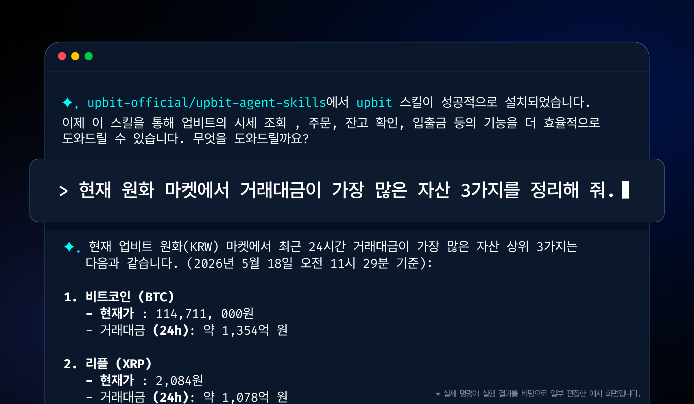

# Upbit Skills

[English](./README.md) | 한국어

디지털 자산 거래소 [업비트](https://www.upbit.com) API 기반의 AI 에이전트 스킬입니다.

Upbit Skills는 AI 에이전트가 업비트의 시세 조회, 자산 확인, 주문 실행 등 주요 기능을 자연어로 수행할 수 있도록 지원합니다. 업비트 API 기반 CLI와 연동되어, AI가 상황에 맞는 적절한 지침을 바탕으로 필요한 작업을 수행할 수 있게 합니다.

이 프로젝트는 전문 개발자뿐 아니라, AI 기술 활용에 적극적인 트레이더들을 위해 만들어졌습니다. 코드를 직접 작성하는 부담 없이 AI와 함께 자신만의 트레이딩 환경을 보다 유연하게 구성하고 실험해보세요.



## 설치

[Node.js](https://nodejs.org) 18 이상이 필요합니다.

```bash
npx skills add upbit-official/upbit-agent-skills
```

위 명령은 사용 중인 코딩 에이전트(Claude Code, Cursor, Codex 등)에 스킬을 설치합니다. 전역 설치를 원하면 `-g` 옵션을 사용하세요.

```bash
npx skills add upbit-official/upbit-agent-skills -g
```

이 스킬은 [upbit-cli](https://github.com/upbit-official/upbit-cli)와 연동되어 동작합니다. 아래 명령으로 설치하세요.

```bash
npm install -g @upbit-official/upbit-cli
```

## 스킬 목록

| 스킬 | 설명 |
|---|---|
| [`upbit`](skills/upbit/upbit/) | CLI 기반 Upbit REST API — 주문, 시세, 입출금, 초기 설정 |

## 인증

설치 후, CLI를 사용해 API 자격 증명을 설정합니다.

```bash
upbit config set
```

자격 증명은 `~/.upbit/config`에 저장되어 모든 CLI 명령에서 자동으로 사용됩니다. API 키는 [Upbit Open API 관리 페이지](https://www.upbit.com/mypage/open_api_management)에서 발급받을 수 있습니다.

환경 변수로도 설정할 수 있습니다.

```bash
export UPBIT_ACCESS_KEY=<your-access-key>
export UPBIT_SECRET_KEY=<your-secret-key>
```

자세한 설정 가이드는 [`setup.md`](skills/upbit/upbit/references/setup.md)를 참고하세요.

## 기여

Upbit Skills는 초기 릴리스 단계로, 현재는 외부 기여(Issues/PRs)를 받지 않고 있습니다.
버그 제보 및 피드백은 open-api@upbit.com으로 이메일 주시기 바랍니다.
프로젝트가 안정화됨에 따라 외부 기여 채널을 단계적으로 개방하는 방안을 검토 중입니다.

## 책임 한정 및 이용 주의 사항

전문은 [DISCLAIMER_KR.md](./DISCLAIMER_KR.md)를 참고하세요.

© 2026 Dunamu Inc. All rights reserved.
